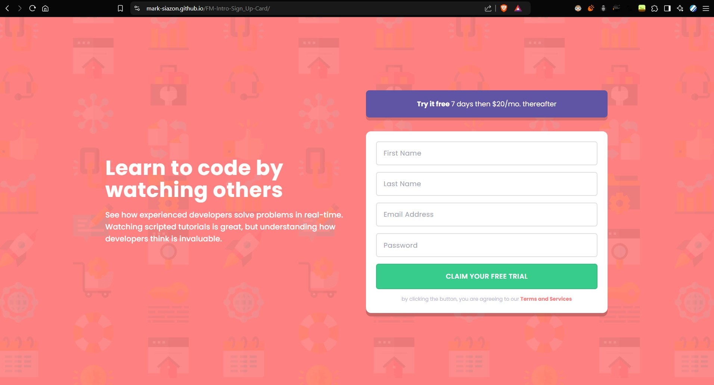
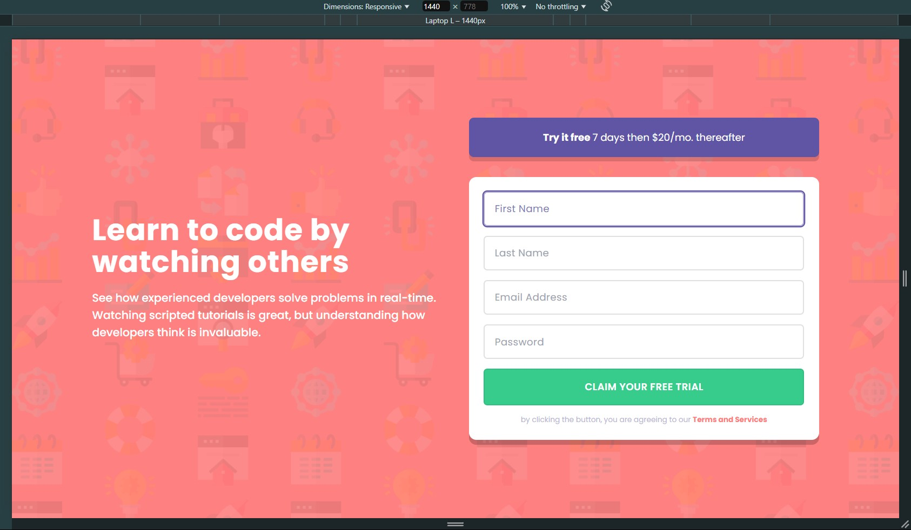
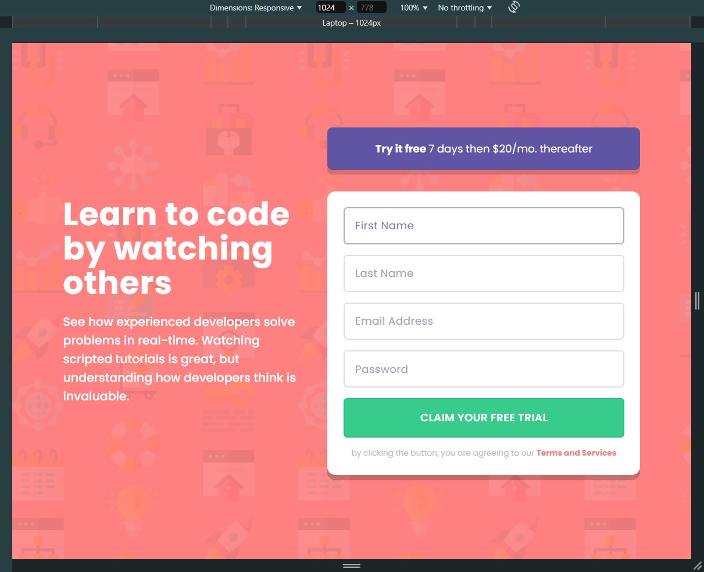
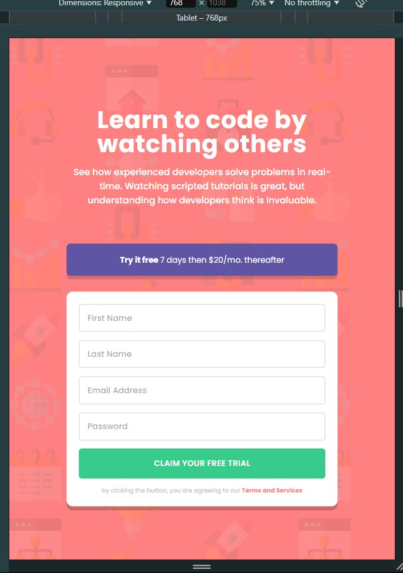
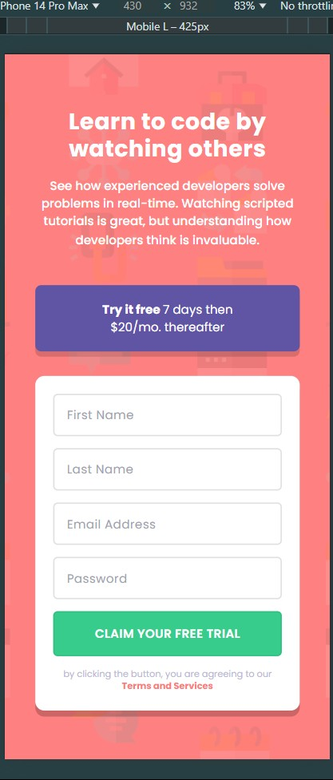
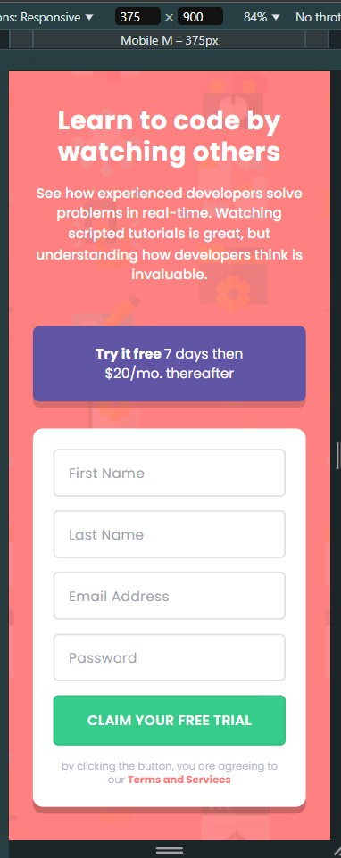
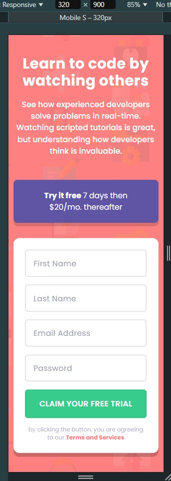

# Frontend Mentor - Intro component with sign-up form

This is a solution to the [Intro component with sign-up form coding challenge on Frontend Mentor](https://www.frontendmentor.io/challenges/intro-component-with-signup-form-5cf91bd49edda32581d28fd1).

Frontend Mentor challenges help improve skills by building realistic projects.

## Table of contents:

This section provides quick links to important sections of the README:

- [Overview](#overview)
  - [The Challenge](#the-challenge)
  - [Screenshot](#screenshots)
  - [Links](#links)
- [My process](#my-process)
  - [Built with](#built-with)
  - [What I learned](#what-i-learned)
- [Author](#author)

## Overview:

This project is part of the [Frontend Mentor](https://www.frontendmentor.io/challenges/intro-component-with-signup-form-5cf91bd49edda32581d28fd1) challenge. The goal of the challenge is to replicate a design and build a functional web page with specific features.

### The Challenge:

**To do this challenge, you need a basic understanding of HTML, CSS, and JavaScript.**
Users should be able to:

- View the optimal layout for the site depending on their device's screen size
- See hover states for all interactive elements on the page
- Receive an error message when the `form` is submitted if:
  - Any `input` field is empty. The message for this error should say _"[Field Name] cannot be empty"_
  - The email address is not formatted correctly (i.e. a correct email address should have this structure: `name@host.tld`). The message for this error should say _"Looks like this is not an email"_

 

### Screenshots:

**Preview of initial original design (Expected result):**
| -------------------------------------------- |
|  |

 
  
**Fullscreen View (Desktop)**
| -------------------------------------------------- |
|  |

**Animated Preview:**
| -------------------------------------------------------- |
|  |
 

**Note: This is a Mobile-First Approach. Please wait for the GIF to load (It takes a while due to file size)**

 

All viewports were included (except for the 4k view), in case the observer wishes to see the minor changes.

 

| Desktop View (1440px)                             | Laptop View (1024px)                             | Tablet View (768px)                              |
| ------------------------------------------------- | ------------------------------------------------ | ------------------------------------------------ |
|  |  |  |

| Mobile L (430px)                                  | Mobile M (375px)                                  | Mobile S (320px)                                  |
| ------------------------------------------------- | ------------------------------------------------- | ------------------------------------------------- |
|  |  |  |

### Links:

- **Live Site URL**: [View Live Site](https://mark-siazon.github.io/FM-Intro-Sign_Up-Card/)
- **Solution URL**: [View Solution on Frontend Mentor](https://www.frontendmentor.io/solutions/intro-sign-up-card-responsive-mobile-first-tsreactjsvitetailwind-xDHv-PZicE)

## My process:

### Built with:

**Core Technologies**

- HTML5, CSS3, JS/TS

**Framework & Tools**

- ReactJS + Vite & PostCSS
- TailwindCSS, SASS/SCSS & NPM

**Design Principles**

- Mobile-First Approach (Flexbox Layout)
- Responsive Web Design

**Development Practices**

- Version Control with Git & GitHub
- Code Linting (ESLint for JavaScript, Stylelint for CSS)

### What I learned:

Recap over some of the major learnings while working through this project:

- **Flexbox and Grid**: Gained a stronger understanding of layout techniques for responsive design.
- **JavaScript Form Validation**: Improved skills in validating user input, handling errors, and displaying feedback.
- **SASS/SCSS**: Learned advanced SCSS features like nesting and mixins for cleaner, maintainable CSS.

## Author:

- ‎ ‎ ‎ ‎ ‎ ‎ 
- ‎ ‎ ‎ ‎ ‎ ‎ 
- 
- 

 

- _Updated_: 01/22/2025
- _(The assets used in this project are originally from Frontend Mentor)_
